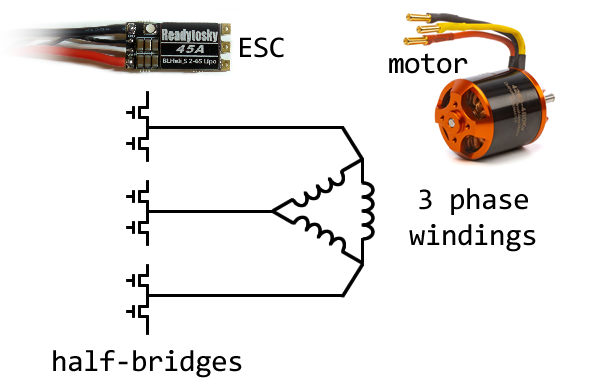
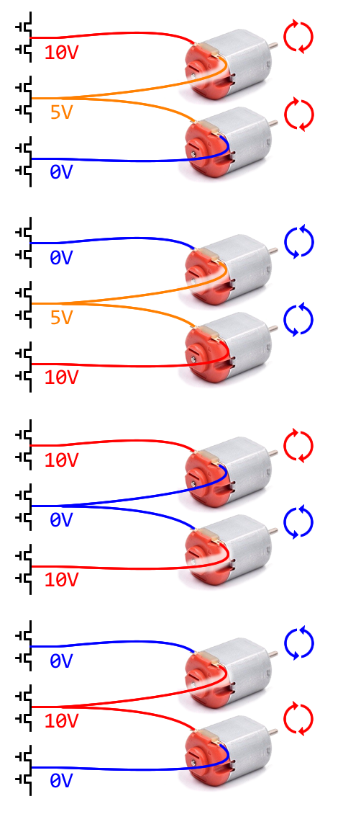
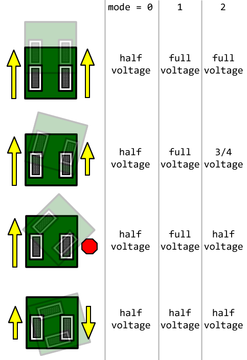

# FloorIt-Dual-Brushed-Motor-ESC
Dual brushed motor ESC compatible with brushless motor ESCs

This is a replacement firmware for brushless motor ESCs that will convert them to being brushed motor ESCs that can independantly drive two brushed motors. This is advantagous because brushless motor ESCs are usually smaller and cheaper, when compared to buying dedicated dual motor brushed motor ESCs.

This firmware must be installed after AM32 is installed on the ESC, as the installation needs to be done through the AM32 bootloader.

To control the ESC, RC pulse signals (PWM) are supported, and also the CRSF serial protocol is supported.

To configure the ESC, there is a command-line-interface (CLI) implemented, where various commands are used to manipulate stored settings.

# Principle of Operation

Brushless motor ESCs have 6 MOSFETs on them to form 3 half-bridges. These drive the three windings inside a brushless motor. Each half-bridge is driven by a PWM signal, which can approximate a voltage.

Instead of connecting a single brushless motor, we connect two brushed motors. By changing the voltage (changing the PWM signal's duty cycle) of each half-bridge, we can control each of these two brushed motors indepedantly.

Most ESCs only have one signal input for control. This hack can only be used with ESCs that have a second signal input, or ESCs that can take serial multi-channel-combined protocols.

# Caveats

Depending on which direction the two motors spin, the motors can get either up to full voltage, or half voltage. If the motors are used to drive a tank-style robot, then it can drive forward and backwards really fast with full battery voltage, but the speed when it turns will be slower as it can only use half of the battery voltage. There are three ways that the ESC can mix the voltage, explained by this diagram:

The completely linear half-voltage mode might make driving more predictable, but it is wasting potential performance. The other two modes will have a slight non-linear feeling as the robot begins to turn, but this can be resolved with another curve set on the transmitter.

Also, when used for brushless motors, each MOSFET is only turned on for a brief moment, all of the MOSFET share the same load. But when used for brushless motors, it is possible for one MOSFET to be on all of the time while another one is turned off all of the time, and the shared-common half-bridge passes more current through it than the other MOSFETs. For these reasons, the effective new current handling rating of the ESC is about 20% of the original ESC rating. If you purchased a ESC rated for 45A, then you should only use motors that require up to 9A each.

# Instructions

 * [Install AM32](doc/install-am32.md)
 * [Install Firmware](doc/install-firmware.md)
 * [Configuration](doc/configuration.md)
 * [Build Instructions](doc/build-instructions.md)
