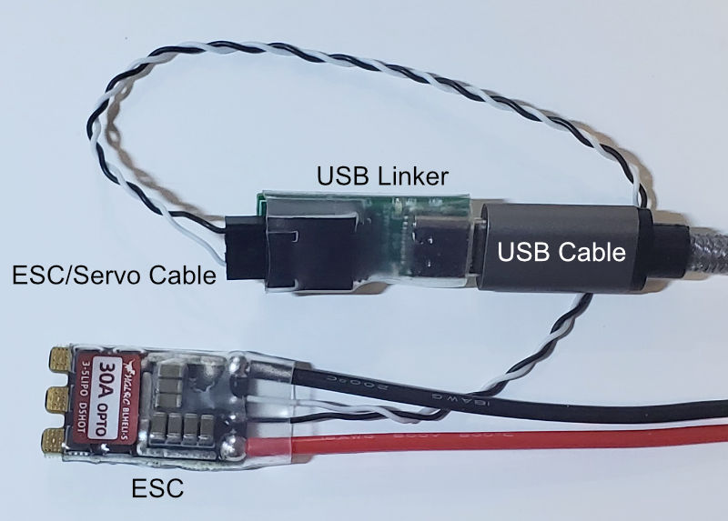
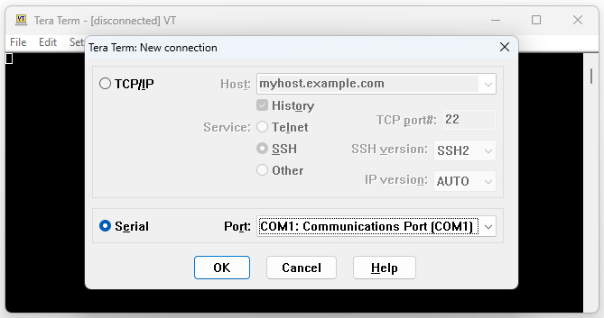
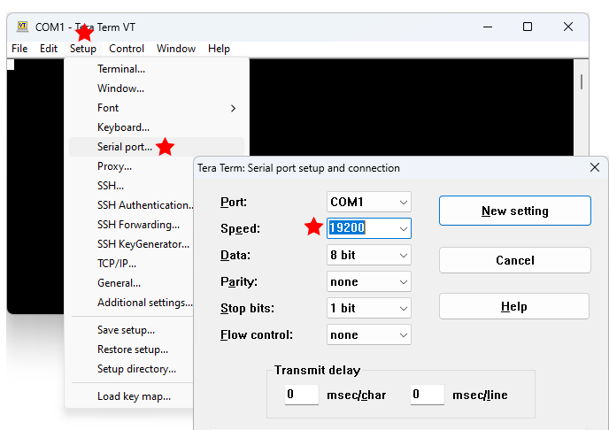
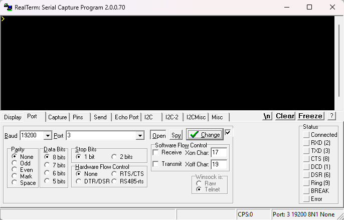

The CLI (command line interface) is how the user can configure the ESC, and also perform some simple tests.

# Getting into the CLI

## Required: USB Linker

To install, update, and configure Hydra firmware, you must use a USB-linker meant for communicating with ESCs.

See this [wiki page](../../../wiki/USB-Linker) for a list of linkers you can use. That page also has links to the appropriate USB drivers that you might need to install.

## Required: Serial Terminal App

You need a simple serial terminal app of some sort installed on your computer.

For Windows, some of the popular choices: [Tera Term](https://tera-term.en.softonic.com/), [PuTTY](https://putty.org/), [RealTerm](https://realterm.sourceforge.io/), Arduino IDE's built-in serial monitor, some of the extensions available in VSCode

For Linux, perhaps try: `Minicom`, `picocom`, `screen`, `gtkterm`

Please remember to choose the correct serial port (the name will vary), and then configure the serial port for 19200 baud rate, 8 bits, no parity.

SparkFun Electronics has a [tutorial about serial terminals](https://learn.sparkfun.com/tutorials/terminal-basics/real-term-windows)

## Connecting the USB linker

These steps are different from installing the firmware. Please do not confuse the two different instructions.

 1. Make sure the ESC is disconnected from everything. Do not connect the USB linker to it just yet. Keep the power off.

 2. Power on the ESC. The LED should indicate that it is disarmed (LED will stay solid RED, or whatever colour is used).

 3. Wait 10 seconds. After 10 seconds have passed, the LED blinking should have changed to a different pattern 

 4. Connect the USB linker to the computer

 5. Connect the USB linker to the ESC

 6. Run the serial terminal app

The LED blink pattern will change again to indicate successfully entering CLI mode 

Send the enter keystroke into the terminal a few times and you should see `>` appear on your screen. This means you are ready to enter in a command.

NOTE: arrow keys will never work, the delete or backspace key will simply cancel the entire command

NOTE: the CLI will never exit until you reboot the entire ESC with the USB linker disconnected

## The most important settings to change

 * `vsplitmode` is defaulted to the weakest mode that is easy to use, you might want to try out one of the boost modes
 * `inputmode` is obviously important if you are using CRSF or had problems doing the input wiring
 * `phasemap` is important because you don't know which motor output phase is the default common-shared phase, you can test for the correct value with the `testpwm` command (more details below)

# Using the CLI

## Reading current settings

The command is `list`

It will output a giant list of all of the settings.

You can copy this block of text into a text file for safekeeping.

(there's a section later describing each of the setting items)

## Changing a setting

The command looks like `<setting-name> <value>`, for example, `inputmode 1`.

A confirmation will shown if you are successful.

If you pasted in multiple lines, it will change multiple settings all at once. So you may paste in the text file you saved earlier.

WARNING: please don't go crazy with the values. The CLI is only smart enough to know if you forgot to include a value, or if you made a spelling mistake, but it cannot actually check if your value is within the correct range.

NOTE: for settings that are either true or false, please use `1` or `0`

(there's a section later describing each of the setting items)

## Factory Reset

The command is `factoryreset`

This will change every setting back to their default values.

## Reboot

The command is `reboot`

This will cause the ESC to enter into the AM32 bootloader.

# Available Settings and What They Mean

| command        | default | range       | description |
|----------------|---------|-------------|-------------|
| `vsplitmode  ` | 0       | 0 - 2       | voltage splitting mode   0 = half voltage   1 = boosted always   2 = boosted while not turning |
| `loadbal     ` | 0       | 0 or 1      | lowers load on common-shared MOSFET |
| `inputmode   ` | 0       | 0 - 3       | 0 = RC PWM pulse input   1 = CRSF input   2 = RC PWM input through SWCLK   3 = CRSF input through SWCLK |
| `phasemap    ` | 1       | 1 - 3       | selects which one of the three phases is used as the common-shared phase |  
| `baud        ` | 0       |             | baud rate used for CRSF   0 means default (420000)   useful for taking commands from slower microcontrollers |
| `channel_1   ` | 1       | 0 - 16      | which CRSF channel is the first channel, 0 = unassigned |
| `channel_2   ` | 2       | 0 - 16      | which CRSF channel is the first channel, 0 = unassigned |
| `channel_mode` | 5       | 0 - 16      | which CRSF channel can control the voltage splitting mode, useful for temporary   voltage boosting, 0 = unassigned |
| `rc_mid      ` | 1500    | 800 - 2200  | RC PWM pulse middle value, in microseconds, does not affect CRSF |
| `rc_range    ` | 500     | 0 - 1000    | RC PWM pulse range, 500 means 1000 to 2000, does not affect CRSF |
| `rc_deadzone ` | 10      | 0 - uint16  | RC PWM pusle deadzone around the center   used if the signal is noisy   unit is in microseconds   does also apply to CRSF |
| `pwm_reload  ` | ????    | 0 - 65535   | PWM generator reload value, controls the PWM frequency   Do not modify   lower value = higher frequency
| `pwm_headroom` | 50      | 0 - uint32  | PWM cannot be always 100% since the MOSFET drivers use a charge pump. High value means lower power for the motors, but if the value is too low then the high-side MOSFETs might stop working at full throttle. |
| `braking     ` | 1       | 0 or 1      | If true, enables complementry PWM and never floats the output pins. If false, disables complementry PWM and floats the output pins if throttle is 0 |
| `chanswap    ` | 0       | 0 or 1      | swaps the input channels |
| `flip1       ` | 0       | 0 or 1      | flips (reverse) the 1st input channel |
| `flip2       ` | 0       | 0 or 1      | flips (reverse) the 2nd input channel |
| `tied        ` | 0       | 0 or 1      | one channel controls both motors |
| `armdur      ` | 100     | 0 - uint32  | arming duration required, the number of valid arming pulses (zero throttle) required before becoming armed   setting 0 means **always armed** |
| `disarmtime  ` | 3000    | 0 - uint32       | number of milliseconds of signal loss before going into disarmed state   setting 0 means **never** |
| `templim     ` | 0       | 0 - 255     | temperature limit in degrees-Celcius   setting 0 means limit disabled |
| `currlim     ` | 0       | 0 - 255     | current limit in amps   setting 0 means limit disabled |
| `voltlim     ` | 0       | 0 - 65535   | low battery voltage limit in millivolts   setting 0 means limit disabled |
| `voltdiv     ` | ????    | 0 - uint32  | hardware voltage divider adjustment   default is dependant of hardware, do not adjust if you don't need to |
| `curroffset  ` | ????    | 0 - uint32  | hardware current sensor offset adjustment   default is dependant of hardware, do not adjust if you don't need to |
| `currscale   ` | ????    | 0 - uint32  | hardware current sensor scaling adjustment   default is dependant of hardware, do not adjust if you don't need to |
| `adcfilter   ` | 100     | 1 - 1000    | analog signal low-pass filtering constant, for avoiding noisy sensor measurements   low value means strong filtering, slow changes   high value means weak filtering, fast changes
| `curlimkp    ` | 400     | sint32      | PID constant P for the current limiting feature   do not adjust |
| `curlimki    ` | 0       | sint32      | PID constant I for the current limiting feature   do not adjust |
| `curlimkd    ` | 1000    | sint32      | PID constant D for the current limiting feature   do not adjust |

# Advanced Commands

## Version

Use the command `version` to show some version information.

## Testing Motor Output

Because you don't really know which one of the three phases is the common-shared phase, you can test just one phase to see if it outputs a voltage.

The command looks like `testpwm <arg1> <arg2> <arg3>`, for example, `testpwm 1 100 3000` will power on phase 1 with 100% power for 3 seconds.

The first argument is the phase number, between 1 to 3. When you are happy with it, save it with `phasemap <n>`.

The second argument is the power level, 0 to 100, 100 meaning 100% power.

The thirds argument is the time duration of the test in milliseconds. Using 0 will mean "forever".

The test can be stopped at any time by entering keystrokes into the serial terminal.

During the test, sensor values will be displayed, which can help with finding current sensor values while running a motor.

## Debugging Hardware

The command is `hwdebug`, using it will toggle ON or OFF sensor value output to the serial terminal.

This is useful for tuning the voltage limit and voltage divider value.
