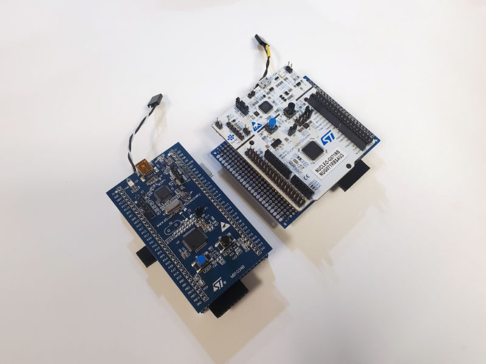
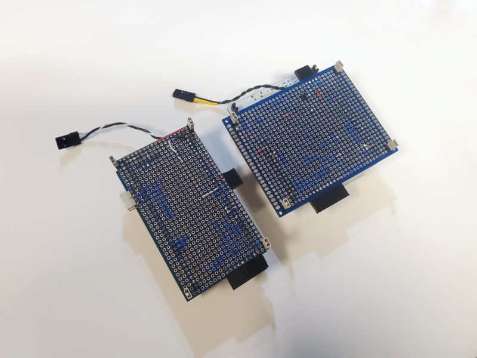
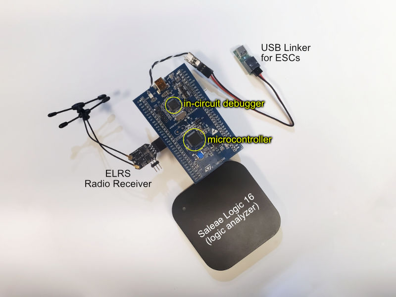
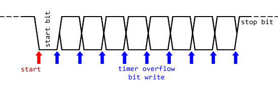

# Origin Story

I was designing a beetleweight (3 lbs) combat robot. For a combination of reasons, I chose to use DartBox motors, which are DC brushed motors spec'ed for the robot combat hobby, but originally meant for nerf guns (hence "dart"). There are 3 different variations of DartBox motors with 3 different power levels, even the lowest power level is better than a large portion of the motor market that are commonly used for beetleweight combat robots. Currently, the three variations are the Gecko (would need 4.5A during stall with the battery I wanted to use), Viper (12A), and Dragon (17A). The Gecko would've worked fine for my robot, but a Viper motor would be a nice upgrade.

The market for circuitry that can drive these motors is fairly small. The guy who created the DartBox motor family also sells some motor drivers for them but they are rather big and I don't want to use them. Every other options on the market is are also either too big, too expensive, too weak, or otherwise unsuitable.

But... think about the proliferation of small brushless ESCs (electronic speed controller) meant for DIY drones, there's a ocean of ESCs of every size. These ESCs are supposed to intelligently generate a 3 phase power waveform to spin brushless motors using three half-bridges.

Brushless motor ESCs have 6 MOSFETs on them to form 3 half-bridges. These drive the three windings inside a brushless motor. Each half-bridge is driven by a PWM signal, which can approximate a voltage.

To drive a single brushed motor bidirectionally, a H-bridge circuit is needed, which actually just means two half-bridges.

So thus a brushless ESC can easily be used to drive a brushed motor as well. AM32 brushless ESC firmware (which is open source) has its own separate brushed-mode releases for ESCs using 32-bit microcontrollers. There's also Greenjay firmware that's dedicated to driving brushed motor using cheaper ESCs using 8-bit microcontrollers.

(I did not write the Greenjay firmware, but I have a [forked repo of Greenjay with documentation on how to use it](https://github.com/frank26080115/greenjay). I was actually writing it but the Bluejay developers told me that they already wrote it for a customer, and the customer allowed them to open-source it)

**But how about driving two motors?**

Instead of connecting a single brushless motor, we connect two brushed motors. By changing the voltage (changing the PWM signal's duty cycle) of each half-bridge, we can control each of these two brushed motors independently.

This technique is known, author of AM32 actually showed me videos of him driving two brushed motors from a single brushless ESCs, he already has the code somewhere on his own computer. Repeat Robotics also sells a brushless ESC preloaded with AM32 firmware and the hardware was actually designed with an extra signal input for this kind of operation. But apparently there was nobody interested. The feature doesn't exist and the code was never published.

I was interested though, and I had ideas about how to give the motors an extra boost in voltage, purely for tank-drive robots. Thinking about my idea, it would drive a bit weird since the voltage curve would not be linear, but I wanted to try it out and think it will be successful.

AM32 is a good starting point, it has some commercially availability already and is open source. I actually wrote out my proposed algorithm for a more complex mixing of the motor voltages, and also documented the way my code repurposed some of the configuration bytes in the user configuration EEPROM. I sent my work to AM32's author, he was appreciative but he works on the firmware on a private copy on his local computer and it wouldn't be practical to add my changes since the project has already changed so much. A version of the firmware will be released later with an entirely different configuration application, adding a ton of more user configurable options, and will not even be at all backwards compatible.

I'm a robotics competition competitor so I actually kind of have a deadline for myself, so I just decided to write the brushed-mode firmware on my own instead of waiting on AM32's next github update. It'll need to be compatible with the AM32 bootloader because it'll be easy for me and other people to purchase a AM32-pre-loaded ESC as a starting point.

# Starting my own firmware

Because I don't want to maintain both a desktop configuration app just for my firmware, I decided that the firmware itself will feature a CLI (command line interface). The user will be able to connect to this CLI through the same connection as if they were configuring (or bootloading) any other ESC, but instead of running a dedicated app, the user needs to run a serial terminal on their computer, and my firmware will accept simple commands from the user to edit each option. This kind of feature will actually require a lot of memory, but since brushed motors are much easier to control than brushless motors, I will be using less memory than AM32 already. Plus, there's not a ton of things that need to be adjusted compared to a brushless motor, so the lack of a GUI is more acceptable.

To start the project, I borrowed elements from AM32, the AM32 makefile was useful as a starting point and nice to use to build for all the potential hardware variations in one command. I made edits to it:

 * instead of using one single GCC command for compiling all the files and then linking, I split it out into individual commands. GCC for C files, G++ for C++, and the linker generates a nice listing file with sorted function size analysis
 * more friendly on Windows OS
 * incremental builds are possible now

I also used AM32's `targets.h` file, which has pin assignment definitions for different ESCs out on the market. But only some of these targets are useful, as driving two motors requires some form of additional signal input. Also it makes no sense to put my firmware on a 4-in-1 ESC, I don't need to drive 8 motors at once.

I also made the project compatible with STM32's official IDE, so that I can use a SWD debugger with the code (but I use VSCode to edit).

Narrowing down the potential ESC targets, it was decided that I only need the code to work on the STM32F051 microcontroller and the STM32G071 microcontroller. I purchased the associated development boards from ST, as their (very affordable) development boards, called the Discovery and Nucleo, have built-in SWD debuggers compatible with their official IDE.

I used blank perf-boards to construct daughter-boards for these development boards.

These daughter-boards make it simple to connect up a ELRS radio receiver, which generates the control input signals as both PWM and also the CRSF protocol. I added a connector for a logic analyzer so that I can monitor all the 6 PWM signals driving the 6 MOSFETs. A connector is dedicated to the USB-linker dongle used for configuring other ESCs, so that I can test the CLI functionality properly. And I also added fake voltage dividers to make sure that the ADC is working, so that I can add the low battery limit and current limiting.

# Software Engineering

The code is written to be very modular, and using C++ object class inheritance in appropriate places. The simplifies the code and I also write specific tests for all the modules, kind of like unit tests but a bit more broad. It does chew up a bit more memory but as I said before, brushed mode operation does not take as much memory as brushless motors.

I did actually make the mistake of using `malloc` and `new` in the code, and the code didn't fit in the 32 KB available. Now the code uses static buffers and global instances of the classes after realizing my mistake. In my own defense, my previous few projects have been [very complex ESP32 projects](https://github.com/frank26080115/alpha-fairy/), and ESP32 usually comes with gigantic flash memory but executes from RAM. My ESP32 projects had heavy usage of GUI menu systems where inheritance was very useful, and if I didn't manage memory properly, then my sprite animations ran slowly if I loaded it from flash for every frame.

For my ESC firmware, inheritance is used for two major things:

 * All of the possible serial port variations are abstracted, inheriting from a single parent class, so that the CLI doesn't care what kind of serial port implementation it is talking over.
 * The signal inputs from the radio remote receiver have three different implementations, but the main code doesn't need to care. Each implementation handles its own deadzone calculations and arming state tracking internally.

To further explain why this is necessary, please understand:

 * both AM32 firmware and my firmware are running on hardware we did not actually design
 * driving two motors requires two signal inputs instead of just one
 * the input signals are sometimes PWM pulses that need to be measured, ideally with microsecond accuracy
 * CRSF signal inputs are extremely high speed

The main signal input on these ESCs are typically connected to a timer peripheral internally so that the timer can automatically measure PWM pulses easily with no jitter. Finding a way to get the second signal input is the first challenge. Sometimes the ESCs will have a telemetry pin connected to a USART peripheral internally, but not a timer peripheral. So if I wanted it to measure PWM pulses, it has to be implemented by a GPIO edge ISR (interrupt service routine) that uses a free running timer to do the measurement, this technique might result in jitter. Of course, my testing showed that it is fine, jitter is much less than a microsecond.

Whether or not the main signal input is also connected to a USART peripheral internally decides if the CLI uses a USART implementation of a serial port, or a bit-bang implementation.

CRSF signal input means reading a serial stream at 420000 baud, which is way too fast for a bit-bang implementation, so it always require either the main signal input or the telemetry pin. Luckily, the STM32's USART peripherals feature half-duplex mode and a pin-swap mode, so any TX pin can also act as RX.

If the secondary signal input is indeed missing, then there's a problem, but since the factories making these ESCs need to be able to flash the firmware somehow, usually the SWDIO and SWCLK signals have dedicated test-points on the circuit board. The SWCLK signal is connected to a USART peripheral internally, and also can be used as a GPIO. Thus it can become a signal input that's easy for the user to solder a wire to.

All of this means I have about 5 classes inheriting from 2 parent classes:

 * Serial Port
   * USART
   * bit-bang
 * RC Signal
   * timer input capture
   * GPIO edge ISR
   * CRSF packet parser

# Other: bit-bang serial port

AM32's bootloaded implemented this as a simple pin toggle with hard-coded delay loops to manage the timing, and it only exists in the bootloader code, which needs to be small. Since the CRSF input required high performance, I structured the parent class to have a non-blocking API with FIFOs, so I didn't want to use the same code AM32 used. My own implementation uses the timer peripheral connected to the main signal input.

For receiving a byte, the timer is capable of being reset upon a signal edge. The overflow time is set to the time width of a single bit, and an interrupt is set to occur at exactly half of that width, as the time to sample the bit from the GPIO pin. This interrupt will naturally repeat at the time width for a single bit in order to read in all the bits of a byte.

For transmitting a byte, the same timer set to the same overflow time for exactly one bit, and very simply, the overflow interrupt is used to send out one bit at a time.

Very very easy to implement, and it all happens with perfect timing in a non-blocking fashion.

NOTE: timer overflow is called an `UPDATE` event on STM32 microcontrollers

# Other: CRSF input

The CRSF parser code I borrowed from the old AM32 repo (the author works on the code locally, the last time he updated the code, it was so different that he just made a new GitHub repo instead of making a commit to the original repo).

Actually receiving CRSF was a challenge. My first attempt at my serial port parent class used simple circular FIFO buffers that are written to by a ISR upon each single byte, no DMA was used. Testing this implementation resulted in things like massive amounts of CRC errors and the code completely freezing. CRC errors were likely from missing bytes, and completely crashing might've been from the ISR firing so frequently that the main code never actually runs. I tried things like changing if, when, and how often, I disable interrupts to pop from the FIFO. I never got to a satisfactory solution. So then I gave up and decided to switch to using a DMA.

This isn't hard, but writing a FIFO is something I can regurgitate for any platform almost blindfolded. Using a DMA on an unfamiliar platform will require more studying.

(for the curious: the STM32F051 did not feature a dedicated USART FIFO, the STM32G071 does but it's too small, just 8 bytes, CRSF is about 26 bytes per packet)

The original DMA initialization used in AM32 did not work on STM32G071 microcontrollers. So I had to actually understand how to do DMA initialization myself to figure out what was wrong when it didn't work. That wasn't a real problem but I did learn a lot.

What made it a bit annoying is that the DMA had no way of reading back how many bytes have been written, and there are some CRSF packets with a different length than usual. So there's no simple way for the DMA to indicate when a packet is actually ready to be parsed. But luckily the USART peripheral on these STM32 microcontrollers have a idle detection feature, if there is a long time (the time span of a single byte) where there's no activity, it generates an interrupt. So the idle flag is used to indicate when a packet is ready to be parsed.

(there are other workarounds, like tracking the USART reception with a ISR, and also just constantly parsing the buffer until the CRC is valid)

# Other: PC tool

To make installation easy, I wrote a PC tool using Python. It is naturally cross-platform and the Windows build includes an executable that the user can simply double-click. I did not bother with making a fancy GUI because all the app needs to know is "which file?" and "which serial port?".

However, since there are many variations of hardware, there are many variations of firmware builds to match. The AM32 bootloader's API does identify: what microcontroller, and which pin is being used for main input

My firmware builds have additional embedded metadata that also identifies which microcontroller and what pin is being used.

My PC app does do a check to see if the firmware file's embedded metadata does match. This will at least guarantee that the user can use the CLI after flashing. The CLI has functionality that allows the user to perform further hardware tests as well.

# Feburary 1 2024 - Repeat Robotics Dual Brushless ESC

Repeat Robotics has released a new dual ESC for brushless motors. Everybody in the robotics hobby wanted a 2-in-1 ESC, much like how drone hobbyists use 4-in-1 ESCs. Repeat Robotics is filling this gap!

Today I received mine, and to my horro, it uses a AT32F421 microcontroller. At the time of writing, the Hydra firmware does not support AT32 microcontrollers.

I really want to unveil Hydra firmware to the world by turning this dual ESC into a 3-in-1 so now I'm putting in the effort to support AT32F421 microcontrollers, maybe even AT32F415 later.

The AT32F421 has peripherals nearly identical to the STM32 microcontrollers already being used, but is a M4 core instead of M0, runs faster, and there are other differences. It seems like the Artery brand of microcontrollers are not just clones, they somehow got the internal designs of STM32's peripherals. Even the documentation contains different register names, but their translations actually make sense.

Another annoying thing: the few ESCs on the market with the AT32F421 microcontroller also use the WS2812 LED, which requires tightly timed pulses to control. On STM32G071 based ESCs, this is taken care of by a timer output generator assisted by a DMA so the timing is always perfect. On AT32F421 based ESCs, the pin appears to be an ordinary GPIO. In the original AM32 source code, timing is handled with a hard-coded wait-loop while interrupts are globally disabled (but AM32 does not actually use the LEDs for anything complicated, it's a fancy power indicator). Since my Hydra code has timing sensitive measurements, I chose to make sure data is only being sent to the WS2812 only on the falling edge of the signal being measured, as in, when the measurement is already finished.

# Other: Why CRSF and not SBUS or IBUS

CRSF is awesome, it is used by ExpressLRS because it is high speed, high precision, and it incorporates a CRC for data integrity. The radio receivers that output CRSF are the tiniest on the market.

SBUS is horrible, FrSky products use SBUS and FrSky made it difficult to work with by making it an inverted signal, it was nearly impossible to work with using a 8-bit microcontroller. And then FrSky pulled very anti-consumer moves because the community figured out how to make open source versions of their products, and the market started getting much cheaper 3rd party products. They released new radio transmitters that were straight up not backwards compatible with their older radio receivers, and then they discontinued all of their older receiver products overnight. Their new radio transmitter isn't even that premium and they are charging premium prices for them. I have given away all three of my FrSky radio transmitters already, and I added in a multi-protocol module so the gift receipiants can use other brands of radio receivers with them.

I can't use IBUS, used by FlySky products, simply because I don't have FlySky hardware. Also, the IBUS port only exist on large sized receivers, which defeats the purpose of trying to use less wires.
