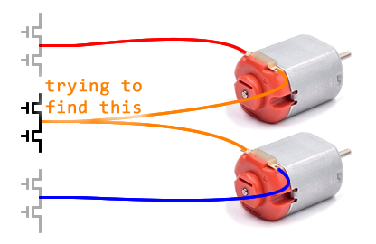

# Finding the Common-Shared Phase

Or rather, we are tring to configure the firmware to use the correct MOSFET half-bridge as the common-shared phase

Prerequisites:

 * Hydra firmware is [installed](install-firmware.md)
 * you understand how to use [CLI mode for configuration](configuration.md)
 * you have a multimeter and knows how to measure voltage

Setup your measurement like this:

Using the CLI, run the command `hwtest`, and it will ask you to choose a test type, press the `p` key.

Pressing the keys `1` to `9` will adjust turn on the currently selected phase, with `9` being maximum power and `1` being minimum power. Pressing `0` will turn it off.

Pressing the `-` or `=` will change the which one of the three phases is being used.

With the multimeter connected as shown, first press `9`, then press `-` or `=` until the multimeter detects a voltage.

Then press the `ESC` key to exit the test mode. The result will be displayed, and a `phasemap` value will be shown.

To save this value, use the command like `phasemap <n>`, where `<n>` is the number you just figured out.

There are only 3 possibilities, if none of these three possibilities worked then something is wrong.
