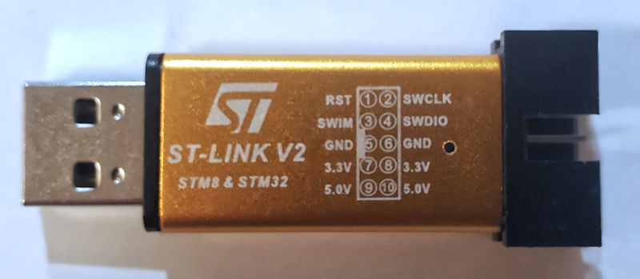
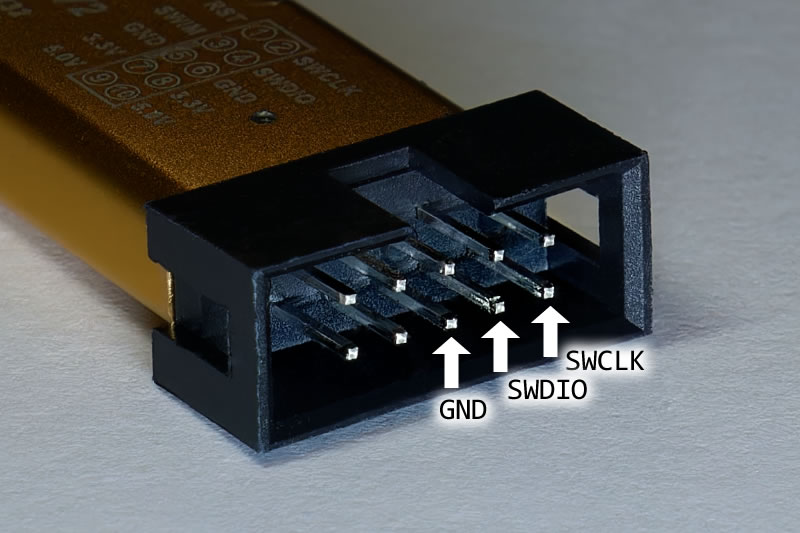
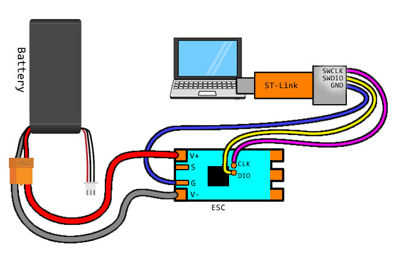
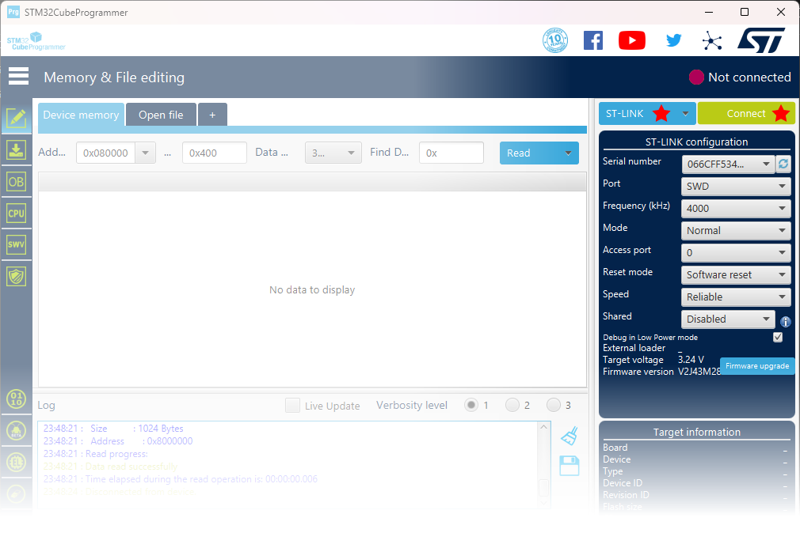
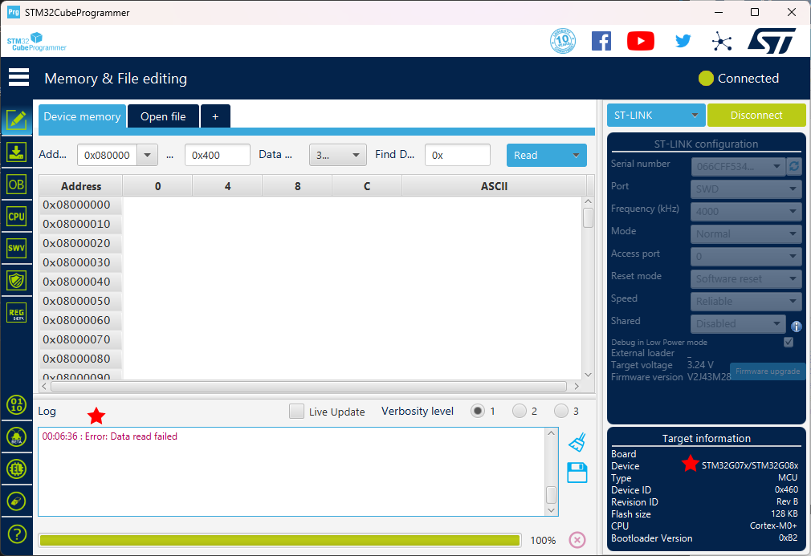
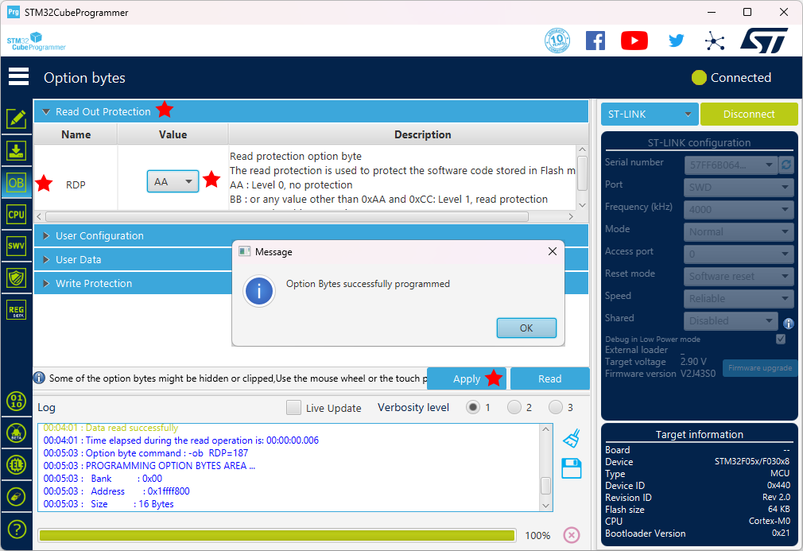
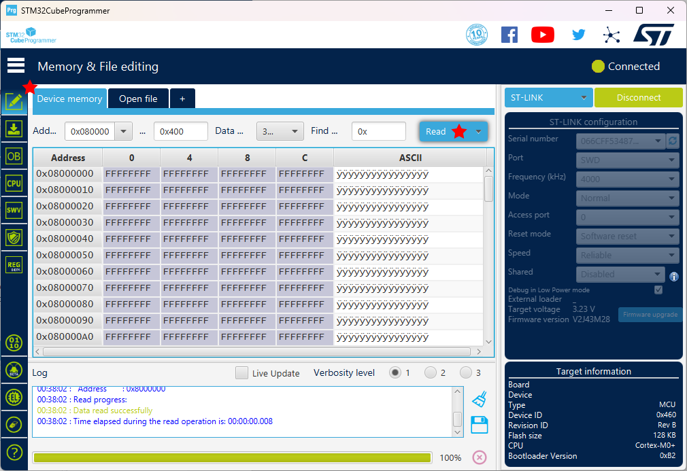
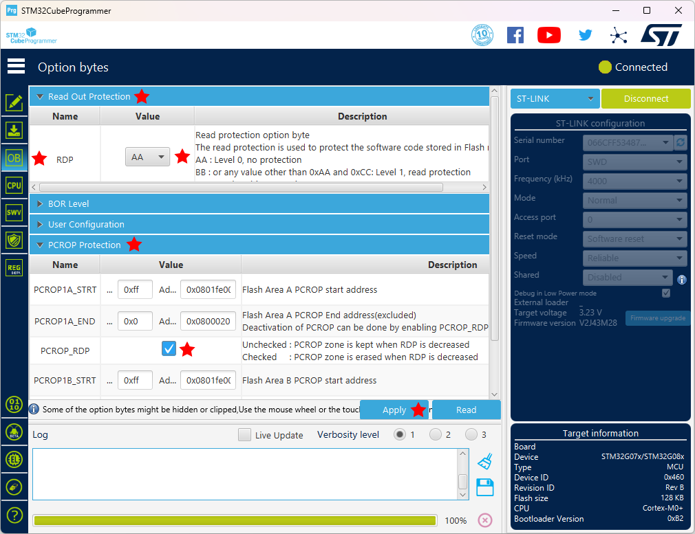
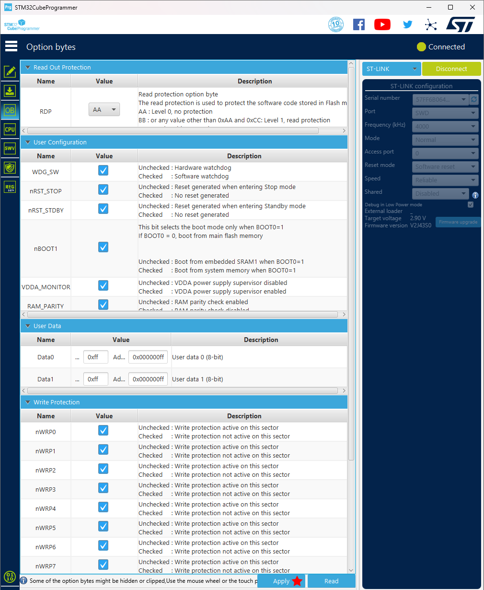
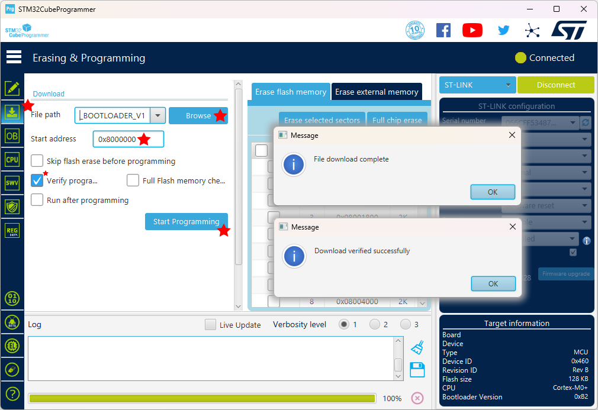

# Installation of AM32

It is much easier to just purchase ESCs that already have AM32 installed:

| Name | Brushless Rating | Brushed Rating 1 Motor | Brushed Rating 2 Motors | Max Voltage | URL |
|------|------------------|------------------------|-------------------------|-------------|-----|
| Repeat Robotics AM32 35A | 35A | 15A | 7A | 6S | https://repeat-robotics.com/buy/am32/ |
| Repeat Robotics AM32 NeutronRC 70A | 70A | 30A | 15A | 8S | https://repeat-robotics.com/buy/ |neutronrc-70a-g071-beetle-weapon-esc/
| Just Cuz Robotics Pariah 70A AM32 | 70A | 30A | 15A | 6S | https://justcuzrobotics.com/products/pariah-70a-am32-weapon-esc |
| SEQURE 70A with AM32 | 70A | 30A | 15A | 6S | https://www.amazon.com/SEQURE-Brushless-Electric-Controller-Airplanes/dp/B0CN6NB8CB/ |

This list does not cover all the options on the market, just the ones I'm aware of. This repo's [wiki has a page with a list](../../../wiki/ESCs-with-AM32-already-installed).

If you want to install AM32 on your own, the original instructions are from the official AM32 project: https://github.com/AlkaMotors/AM32-MultiRotor-ESC-firmware/wiki/Hacking-Guide

My instructions here will reference my own documentation pages.

# Step 0: Tools and Requirements

You will need:

 * good soldering skills, a fine tip soldering iron, thin-ish solder and other soldering accessories.
 * thin wire, something like 28 AWG or 30 AWG, and also be able to terminate them with a dupont-style female connector.
 * ST-Link V2, which is a SWD programmer/debugger for STM32 microcontrollers
 * [STM32CubeProgrammer](https://www.st.com/en/development-tools/stm32cubeprog.html), which is software for the ST-Link

There are cheap places to buy a ST-Link

# Step 1: find the SWD signals on the ESC

I wrote an entire [guide on how to find the SWDIO and SWCLK signals (click here)](other-hardware-hacking.md)

# Step 2: Wiring

First, examine your ST-Link, we need to know where the three signal we need are.

Using a combination of wires and soldering, connect everything as shown:

I wrote an entire [guide on how to find the SWDIO and SWCLK signals (click here)](other-hardware-hacking.md)

# Step 3: Downloading the AM32 Bootloader

You need to know what the microcontroller is on the ESC, and which signal input pin it uses, I wrote an entire [guide on how (click here)](other-hardware-hacking.md)

For STM32F051, download [one of the two bootloaders here](https://github.com/AlkaMotors/AM32_Bootloader_F051/releases/tag/v11)

For STM32G071, download [this bootloader (64K version)](https://github.com/AlkaMotors/g071Bootloader/releases/tag/v7)

# Step 4: Run STM32CubeProgrammer

With everything connected, power on the ESC. Run `STM32CubeProgrammer`. Make sure that `ST-Link` is selected and then click `Connect`. (make sure the settings on the right side of the screen match what is shown in this screenshot)

Most likely, the chip will have security enabled, and the data cannot be read to prevent people from copying it. But you can at least see if you've got the right microcontroller connected.

WARNING: unlocking a BLHeli32's microcontroller causes the firmware to be erased forever, it cannot be undone, you cannot get it back, there's no way to make a backup, it is not available for download, you will be forced to use AM32 forever

# Step 5A: Unlocking F051

If the ESC is using the STM32F051 microcontroller, follow these steps to unlock it:

Open the `OB` tab (option bytes), then open the `Read Out Protection` accordion, then change the `RDP` value to `AA`. Then click `Apply`. A confirmation will appear.

Confirm that you can read the chip now. It will be blank (all 0xFF data).

# Step 5B: Unlocking G071

If the ESC is using the STM32G071 microcontroller, follow these steps to unlock it:

Open the `OB` tab (option bytes), then open the `Read Out Protection` accordion and the `PCROP Protection` accordion

Change the `RDP` value to `AA`. Make sure the `PCROP_RDP` checkbox is **checked**.

Then click `Apply`. A confirmation will appear.

Confirm that you can read the chip now. It will be blank (all 0xFF data).

# Step 6A: More Option Bytes for F051

If the ESC is using the STM32F051 microcontroller: Make sure all the settings checkboxes are checked (no protection whatsoever). Then click `Apply`.

# Step 6B: More Option Bytes for G071

If the ESC is using the STM32G071 microcontroller: Make sure the settings match the table below (if a setting is not mentioned, do not touch it). Then click `Apply`.

| Setting      | Value           |
|--------------|-----------------|
| RDP          | AA (no protection) |
| BOR_EN       | unchecked (disabled) |
| BORR_LEV     | 3 |
| BORF_LEV     | 3 |
| nRST_STOP    | checked (no reset) |
| nRST_STDBY   | checked (no reset) |
| nRST_SHDW    | checked (no reset) |
| IWDG_SW      | checked (software) |
| IWDG_STOP    | checked (active) |
| IWDG_STDBY   | checked (active) |
| WWDG_SW      | checked (software) |
| RAM_PARITY_CHECK | checked (disabled) |
| nBOOT_SEL    | checked (use nBOOT0 bit) |
| nBOOT1       | checked |
| nBOOT0       | checked |
| NRST_MODE    | 3 |
| IRHEN        | checked |
| PCROP_RDP    | **unchecked** |
| WRP1A_END    | Value **0x00**, Address 0x08000000 |
| WRP1B_END    | Value **0x00**, Address 0x08000000 |
| BOOT_LOCK    | **unchecked** |

# Step 7: Write the Firmware File

Open the `Download` tab. Use the `Browse` button to select the bootloader file you have downloaded before. Set the `Start Address` to `0x8000000` (please do not get this wrong). Make sure `Verify` is checked.

Click `Start Programming`. The flashing process will start, and then you will get some confirmations.

You are done.

Next step is to [install the Hydra firmware](install-firmware.md)
