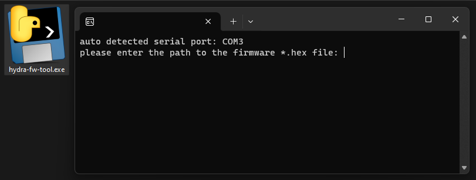

# Required: USB Linker

To install, update, and configure Hydra firmware, you must use a USB-linker meant for communicating with ESCs.

See this [wiki page](../../../wiki/USB-Linker) for a list of USB-linkers you can use. That page also has links to the appropriate USB drivers that you might need to install.

# Connecting to the ESC

 1. Keep the ESC's power completely off
 
 2. Connect it to the USB linker through the main signal input cable (the servo cable).
 
 3. Connect the USB linker to the PC

 4. Power up the ESC

This sequence activates the AM32 bootloader. If you connect it in a different sequence, the bootloader might not activate.

# Running the firmware installer tool

## Get the firmware *.hex file

Download (or build) the appropriate firmware for your particular ESC, in the form of a `*.hex` file. See the firmware release download page.

## Windows

The PC app is provided for Windows: [hydra-fw-tool.exe](../tools/dist/hydra-fw-tool.exe). Simply run this tool and follow the on-screen instructions. All you need to do is to tell it which serial port to use, and then tell it where the firmware `*.hex` file is.

## Linux

For Linux (and Mac?), the Python script is provided at [hydra-fw-tool.py](../tools/hydra-fw-tool.py). It is supposed to be run with Python 3.7 (and later), and it will automatically inform you about dependencies.

Assuming you have Python 3.7 (or later) installed, `cd` navigate to where you've place the python script, and then run `python hydra-fw-tool.py`. Then follow the on-screen instructions. All you need to do is to tell it which serial port to use, and then tell it where the firmware `*.hex` file is.

## Notes about the tool

There are hidden options that are available, use `hydra-fw-tool.exe --help` or `python hydra-fw-tool.py --help` from a command-line-prompt/terminal to reveal them.

The tool will automatically attempt to prevent you from writing the wrong file. This functionality is not perfect. But if it does throw an error, please don't ignore it.

Pressing the key combination `CTRL + C` will interrupt the app and cause it to quit.
