The Hydra firmware was written for the ESCs using STM32F051 and STM32G071 microcontrollers. The ESCs on the market vary a bit between different models and different manufactures, these are the main points that we are worried about:

 * which pin is used for the main signal input
   * there are two possibilities, PA2 or PB4, STM32G071 only uses PB4
 * what kind of LED is on the circuit
   * single-colour or RGB-capable
 * is it preloaded with the AM32 bootloader

In the firmware release package, there are files marked as `GENERIC` that are also marked with the above variations. For example, the file named `GENERIC_F051_PA2_RGBLED` means it's compiled for a STM32F051 microcontroller that is using PA2 as the main signal input, and has a RGB LED on it.

# Determining Which Input Pin

If the AM32 bootloader is preloaded, then the Hydra firmware installer will display an error message if you attempt to install a firmware that does not use the same main signal input pin as the bootloader itself.

If the AM32 bootloader is not preloaded, then this is much more difficult, you can either:

 * use a multimeter's continuity test to determine where on the actual chip the signal leads to, matching it against the STM32F051 datasheet
 * just try different firmwares until it works
 * check against [AM32's database of known ESCs](https://github.com/AlkaMotors/AM32-MultiRotor-ESC-firmware/wiki/List-of-Supported-Hardware)

# Which Microcontroller?

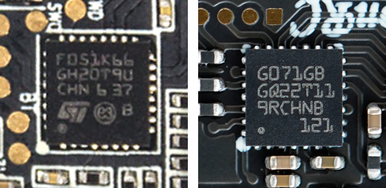

You just need to look at the chip very closely. It will say `F051K6` or `G071GB` on there.

# Determining the LED

If you have a BLHeli_32 ESC, the easiest way to see what kind of LED you have is to just use the ESC for a bit and see if the LED changes colour.

NOTE: AM32 firmware does not actually use multiple colours even if the circuit has a RGB capable LED.

RGB LEDs are rather big, they have a very squarish rectangular shape... 

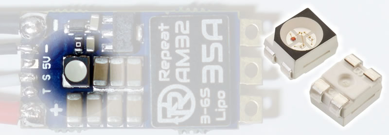

...with a big circle, and 4 legs. Or, some of them look like this:

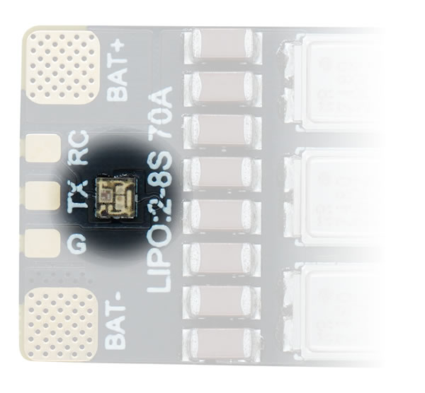

If the LED looks very small and not very complicated inside, then it is probably just single-colour.

You are free to try the RGB firmware on ESCs without a RGB LED, it won't cause damage. In fact, it might actually light up.

# Finding the Telemetry Signal

The best way to use Hydra firmware is to find the telemetry signal on the ESC. You can use it as the second RC PWM pulse input, or you can use it as the CRSF input.

Sometimes it is the signal pad beside the main signal pad. It will be labelled as `T` ot `TX` or `TE`.

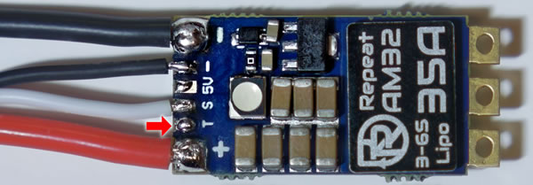
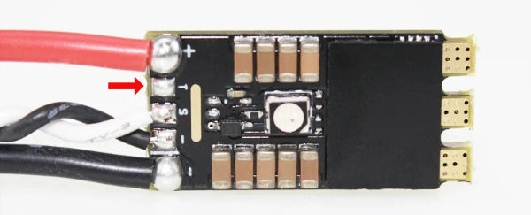
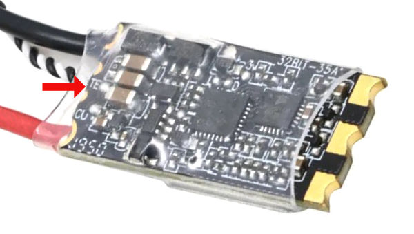
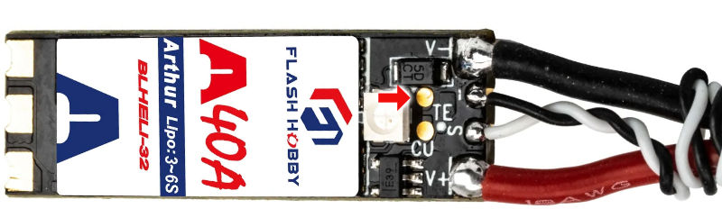

# Finding the SWD Signals

If you cannot find a telemetry signal, then you will need to find the SWD signal called `SWCLK` because SWCLK is capable of being a second signal input that can also handle CRSF input.

Also, if you do not have AM32 preloaded, you will need to find both `SWDIO and `SWCLK`` in order to install AM32.

First, understand where on the microcontroller these signals connect to:

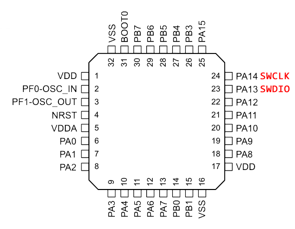

Since they are in the corner, they make it really easy to identify on a ESC's circuit board. SWD signals usually come in a group of 4: `SWCLK`, `SWDIO`, power, and ground. And these signals are usually very close to the microcontroller. Typically, you will be able to visually see which pad corresponds with which signal.

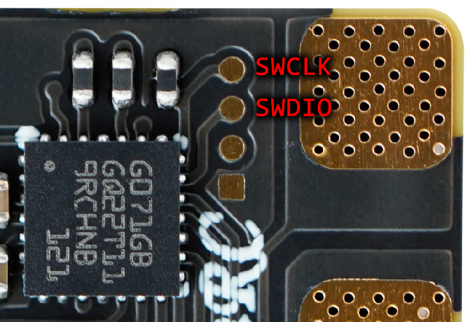

This one is a bit harder but you can still at least see where SWDIO is connected, and then make an assumption about SWCLK.

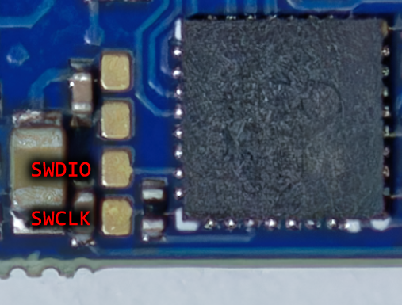

Sometimes they are not in a group of 4, and sometimes they are labelled as `C` for `SWCLK` and `D` for `SWDIO`

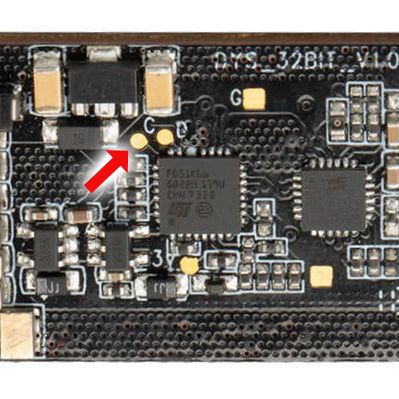