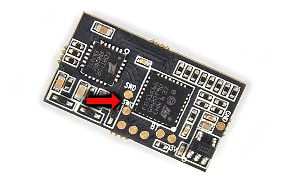
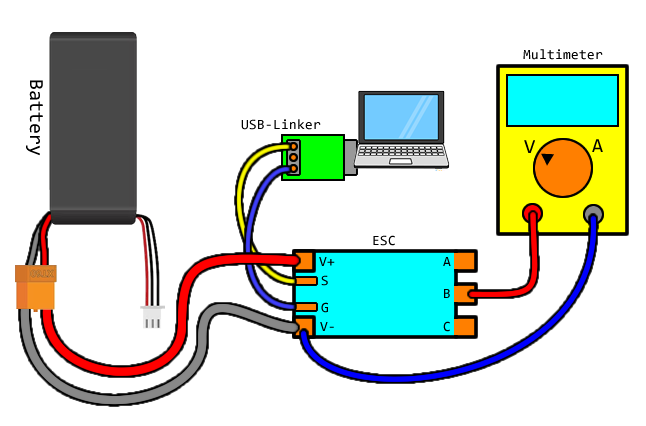
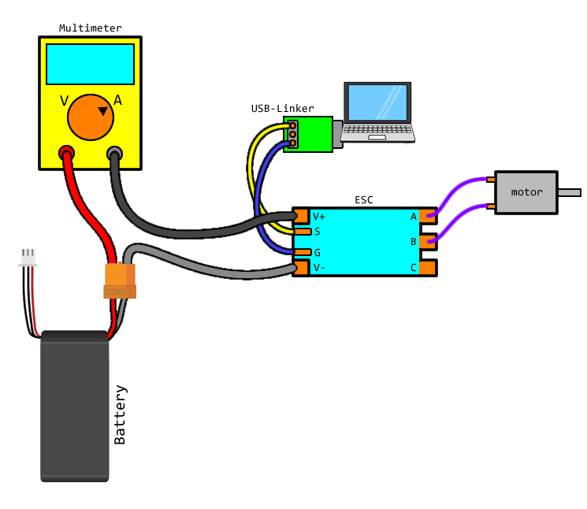

The Hydra firmware was written for the ESCs using STM32F051 and STM32G071 microcontrollers (support for AT32F421 is coming soon). The ESCs on the market vary a bit between different models and different manufactures, these are the main points that we are worried about:

 * which pin is used for the main signal input
   * there are two possibilities, PA2 or PB4, STM32G071 only uses PB4
 * what kind of LED is on the circuit
   * single-colour or RGB-capable
 * is it preloaded with the AM32 bootloader
 * how are the sensors calibrated

In the firmware release package, there are files marked as `GENERIC` that are also marked with the above variations. For example, the file named `GENERIC_F051_PA2_RGBLED` means it's compiled for a STM32F051 microcontroller that is using PA2 as the main signal input, and has a RGB LED on it.

# Determining Which Input Pin

If the AM32 bootloader is preloaded, then the Hydra firmware installer will display an error message if you attempt to install a firmware that does not use the same main signal input pin as the bootloader itself.

If the AM32 bootloader is not preloaded, then this is much more difficult, you can either:

 * use a multimeter's continuity test to determine where on the actual chip the signal leads to, matching it against the STM32F051 datasheet
 * just try different firmwares until it works
 * check against [AM32's database of known ESCs](https://github.com/AlkaMotors/AM32-MultiRotor-ESC-firmware/wiki/List-of-Supported-Hardware)

If you already have Hydra firmware installed on a ESC but need to know what pin it uses for main signal input, then use the CLI and run the command `version`, and it will tell you.

# Which Microcontroller?

You just need to look at the chip very closely. It will say `F051K6` or `G071GB` on there.

# Determining the LED

If you have a BLHeli_32 ESC, the easiest way to see what kind of LED you have is to just use the ESC for a bit and see if the LED changes colour.

NOTE: AM32 firmware does not actually use multiple colours even if the circuit has a RGB capable LED.

RGB LEDs are rather big, they have a very squarish rectangular shape... 

...with a big circle, and 4 legs. Or, some of them look like this:

If the LED looks very small and not very complicated inside, then it is probably just single-colour.

You are free to try the RGB firmware on ESCs without a RGB LED, it won't cause damage. In fact, it might actually light up.

# Finding the Telemetry Signal

The best way to use Hydra firmware is to find the telemetry signal on the ESC. You can use it as the second RC PWM pulse input, or you can use it as the CRSF input.

Sometimes it is the signal pad beside the main signal pad. It will be labelled as `T` ot `TX` or `TE`.

# Finding the SWD Signals

If you cannot find a telemetry signal, then you will need to find the SWD signal called `SWCLK` because SWCLK is capable of being a second signal input that can also handle CRSF input.

Also, if you do not have AM32 preloaded, you will need to find both `SWDIO` and `SWCLK` in order to install AM32.

First, understand where on the microcontroller these signals connect to:

Since they are in the corner, they make it really easy to identify on a ESC's circuit board. SWD signals usually come in a group of 4: `SWCLK`, `SWDIO`, power, and ground. And these signals are usually very close to the microcontroller. Typically, you will be able to visually see which pad corresponds with which signal.

This one is a bit harder but you can still at least see where SWDIO is connected, and then make an assumption about SWCLK.

Sometimes they are not in a group of 4, and sometimes they are labelled as `C` for `SWCLK`, and `D` for `SWDIO`

Here's another example, the `SWC` is hard to read, but you can read `SWD` and just assume the other one is `SWC`

# Finding the Common-Shared Phase

Prerequisites:

 * Hydra firmware is installed
 * you understand how to use CLI mode
 * you have a multimeter and knows how to measure voltage

Setup your measurement like this:

Using the CLI, run the command `testpwm 1 100 3000`, which will send 100% power for 3 seconds. If the meter detected a high change in voltage, then use the command `phasemap 1` to save the value, and you are finished.

If the meter did not detect a big change in voltage, then proceed to try another value. Run the command `testpwm 2 100 3000`, and see if the meter detected a high change in voltage. If the meter detected a high change in voltage, then use the command `phasemap 2` to save the value, and you are finished.

If the meter did not detect a big change in voltage, then proceed to try another value. Run the command `testpwm 3 100 3000`, and see if the meter detected a high change in voltage. If the meter detected a high change in voltage, then use the command `phasemap 3` to save the value, and you are finished.

There are only 3 possibilities, if none of these three possibilities worked then something is wrong.

# Sensor Calibration

Please understand that not all ESCs have voltage sensing or current sensing. If one of these sensors is missing, it might read 0, it might also read crazy noisy values.

You need to do these calibrations in order to use the current limiting feature, and low-battery limiting feature.

Prerequisites:

 * Hydra firmware is installed
 * you understand how to use CLI mode
 * you have saved a copy of your original configuration values
 * you already figured out which phase is the common-shared phase
 * a motor is connected between the common-shared phase and one of the other two phases
 * you have a multimeter, and understand how to measure voltage and current

## Voltage Sensor Calibration

Calibrating the voltage sensing is easy. Use the command `hwtest` in CLI mode to enable the output of the sensors. Measure the voltage you are using to power the ESC. If you are powering the ESC with 7V of electricity, then the value being shown in the CLI screen should read 7000. If the value is reading higher than what it should be, then lower the `voltdiv` value with the CLI. And vice-versa, if the value is reading lower than what it should read, then raise the `voltdiv` value with the CLI.

## Electrical Current Calibration

Then, you should check if the electrical current reading from the CLI screen is reading about zero. If it is not reading zero, then there is an offset, increase the value of `curroffset` until the reading is about zero.

To calibrate the current measurement... there's a smart proper way of doing it, and a really stupid and dangerous way

### Stupid Dangerous Lazy Way

Only do it this if you are 100% certain that:

 * you purchased a ESC that's much more capable than the stall-current rating of both of your motors combined
 * your motors can handle its own stall-current without melting itself
 * your motor's gearbox can handle the stall torque
 * your power supply is sufficient

Connect two motors to the ESC, and clamp their output shafts tightly with something so they cannot spin at all, as in, stalling them.

Using the CLI, run the command `testpwm 1 100 1000`, which will send 100% power to both motors for 1 second. During this one second, you will see the electrical current sensor reading on the screen.

Without a real calibration, you can still use that number as the current limit setting. It will be unitless.

### Proper Way

Have only one motor connected to the ESC.

Wire up your multimeter to measure the electrical current. Please select the correct measurement range, and connect the probes properly. Typically, a multimeter has a different connector for measuring high currents.

Using the CLI, run the command `testpwm 1 25 5000`, which will send 25% power for 5 seconds. Read the multimeter's electrical current reading. The CLI will also report what its current sensor is reading. If the CLI's reading is higher than the multimeter's reading, then increase the value of `currscale`. Vice-versa, if the CLI's reading is lower than the multimeter's reading, then decrease the value of `currscale`.

### Super Proper Way

Instead of a motor, connect up a very powerful constant-current dummy-load meant for electrical testing. And instead of a multimeter, the dummy-load's readings. Simply set the dummy-load to draw 5A exactly, and then use the CLI command `testpwm 1 100 2000`. If the CLI's reading is higher than the dummy-load's reading, then increase the value of `currscale`. Vice-versa, if the CLI's reading is lower than the dummy-load's reading, then decrease the value of `currscale`.
