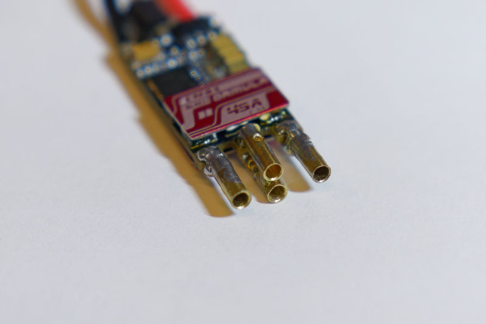
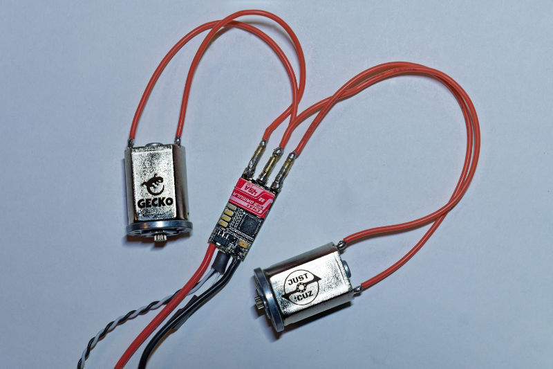
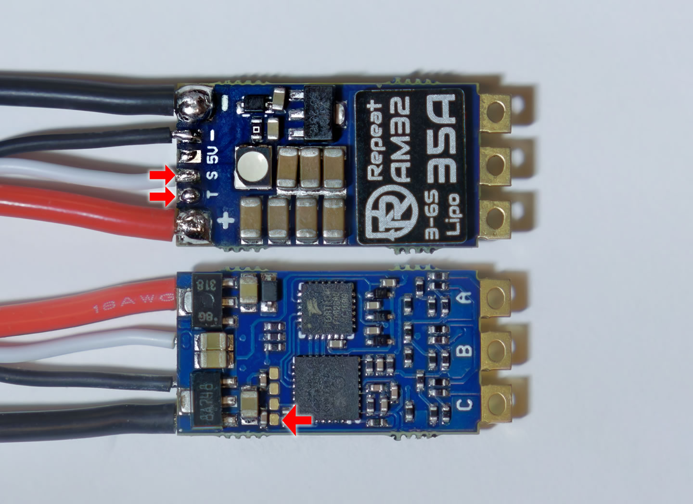
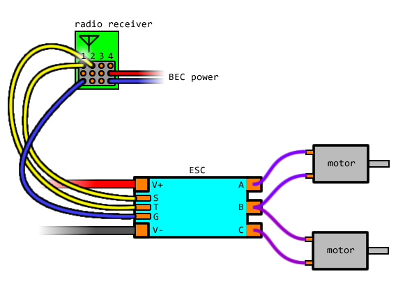
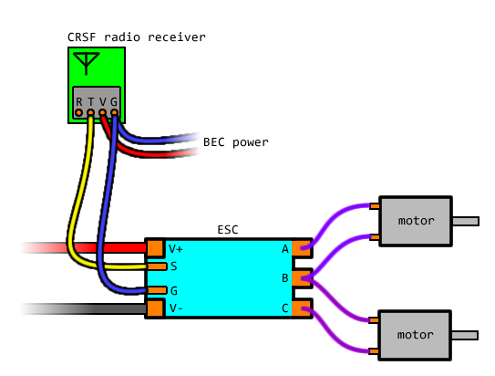
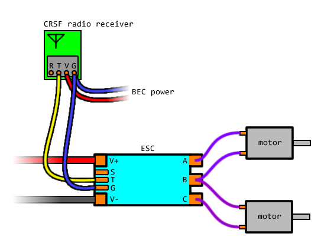

## Wiring the Motors

Ideally you can put some small connectors on the ESC and on the motor wires.

Two connectors needs to be put on the center common-shared phase. The two side phases only need one connector each.

To deliver the full voltage to the motors, they have to be wired in the correct orientation, so it is important to be able to reconnect a motor if it is connected backwards by mistake.

If the behavior is not correct, then the `phasemap` can be changed through the CLI. The command is `phasemap <num>` where `<num>` should be a number that is 1 or 2 or 3. For example, `phasemap 1`. Change it until it works.

(refer to the [page on configuration](configuration.md))

## How to Find the Telemetry and SWD Signal Pads

These signals will be useful later. This is the sort version of the guide. For [a longer guide on how to find these signals, click here.](other-hardware-hacking.md)

The telemetry signal, if it exists, is typically very close to the main signal input. It might be labelled with a `T` or with a word that starts with `T`.

note: Hydra firmware does not ever actually provide telemetry, this functionality simply does not exist and I do not plan on adding it.

The SWD signals are called SWDIO and SWCLK. These either appear as a pair or in a group of 4. The diagrams below have the SWCLK signal indicated.

## For RC PWM Pulse Inputs

The first channel input will always be the main input signal. That usually means the signal wire that came pre-soldered with the ESC, or the traditional signal input solder-pad on the ESC (there might be a `S` letter beside it, or `RC`).

For the second channel input, ideally there is a telemetry solder-pad that can be used.

If there is no telemetry solder-pad, then use the SWCLK pad. (you can short SWDIO to SWCLK if you are unsure which one is which)

## For CRSF Inputs

If the ESC is using `GPIO PA2` as the main signal input, then the CRSF input is the main signal input. Connect it to your receiver's CRSF output (TX) signal.

If the ESC is NOT using `GPIO PA2` as the main signal input, then the CRSF input can use the telemetry solder-pad.

(99% of the time, if a telemetry solder-pad exists, it means that you should use it for CRSF)

If there is no telemetry solder-pad and the ESC is not using `GPIO PA2` as the main signal input, then use the SWCLK pad. (you can short SWDIO to SWCLK if you are unsure which one is which)

## Configuring Input Modes

The command in CLI is `inputmode <num>` where `<num>` is a number. For example, the command will look like `inputmode 1` to change the input mode to be CRSF.

Here's a table of modes and their numbers:

| MODE             | NUM |
|------------------|-----|
| RC PWM Pulse     |   0 |
| CRSF             |   1 |
| RC using SWCLK   |   2 |
| CRSF using SWCLK |   3 |

(refer to the [page on configuration](configuration.md))
